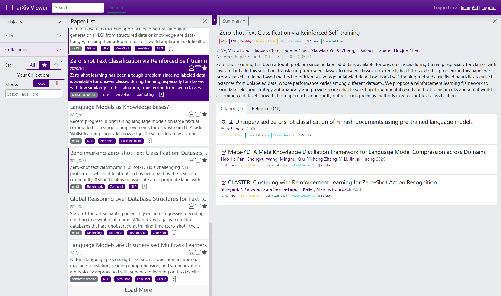

# View Daliy Updates from arXiv

https://arxiv.gtflashlab.com/



## Lanuch DB

[Reference](https://gist.github.com/gwangjinkim/f13bf596fefa7db7d31c22efd1627c7a)

in `db`: 

```bash
pg_ctl -D local_db -l logfile start
psql -d arxivroller_db
```

## Manage

`python manage.py runserver`
`python manage.py test`

Scrape Papers from Arxiv:
`python manage.py runscript scrape_arxiv --traceback`
or specify the categories
`python manage.py runscript scrape_arxiv --traceback --script-args cs.LG cs.CL`

(This one is actually used to build data `python manage.py runscript scrape_arxiv --traceback --script-args ml eess stat cs`)

Import bulk [Arxiv Data](https://www.kaggle.com/Cornell-University/arxiv):
`python manage.py runscript import_bulkdata --traceback --script-args path-to-json-file`

## Deploy


### DB

Dump:
```
pg_dump -d arxivroller_db -f db_backup.sql
```

Load:
```
# createuser & password 
# psql
# create user dbuser with encrypted password 'dbuserpwd';
# create database arxivroller_db;
# grant all privileges on database arxivroller_db to dbuser;
psql -U dbuser -d arxivroller_db -f db_backup.sql -h 127.0.0.1
```


### Workflow (Windows)

Following https://www.youtube.com/watch?v=Sa_kQheCnds

1. Get/Set hostname
```bash
hostname
```
2. Get IP address
```bash
ipconfig
```
2. Edit host file `C:\Windows\System32\drivers\etc\hosts`
add a line
```
{ip} {hostname}
```
3. Allow http/tcp (port 80,443) in firewall
4. Edit `settings.py`
- Save `SECRET_KEY` somewhere else
- Save database and/or email credential somewhere else
- Turn off `DEBUG`
- Add ip / domain name to `ALLOWED_HOSTS`
- Add `STATIC_ROOT`
- `SECURE_SSL_REDIRECT`, `SESSION_COOKIE_SECURE`, `CSRF_COOKIE_SECURE` to True
5. `python manage.py collectstatic`
6. `python manage.py compress --force`
7. Run daphne
`daphne -e ssl:443:privateKey=credential/ssl/key.pem:certKey=credential/ssl/cert.pem arxivroller.asgi:application`
`daphne -b 0.0.0.0 -p 80 arxivroller.asgi:application`

### Workflow (Linux)
1. Get/Set hostname
```bash
hostname
```
2. Edit host file `/etc/hosts`
add a line
```
{ip} {hostname}
```
3. Allow http/tcp (port 80,443) in firewall
```bash
sudo apt-get install ufw
sudo ufw default allow outgoing
sudo ufw default deny incoming
sudo ufw allow ssh
sudo ufw allow http
sudo ufw allow https
sudo ufw enable
```
4. Edit `settings.py`
- Save `SECRET_KEY` somewhere else
- Save database and/or email credential somewhere else
- Turn off `DEBUG`
- Add ip / domain name to `ALLOWED_HOSTS`
- Add `STATIC_ROOT`
- `SECURE_SSL_REDIRECT`, `SESSION_COOKIE_SECURE`, `CSRF_COOKIE_SECURE` to True
5. `python manage.py collectstatic`
6. `python manage.py compress --force`
7. Run daphne
`daphne -e ssl:443:privateKey=credential/ssl/key.pem:certKey=credential/ssl/cert.pem arxivroller.asgi:application`
`daphne -b 0.0.0.0 -p 80 arxivroller.asgi:application`


### Notes: Deploy SCSS in Django project

From https://www.accordbox.com/blog/how-use-scss-sass-your-django-project-python-way/

We can push our scss files to Git repo and they would be compiled in the deployment stage.

django_compressor has provide a Django command for us to convert scss files to css files.

First, please add code below to your `settings/production.py`
```
COMPRESS_OFFLINE = True
LIBSASS_OUTPUT_STYLE = 'compressed'
STATICFILES_STORAGE = 'django.contrib.staticfiles.storage.ManifestStaticFilesStorage'
```
Then in your deployment code, please run command `python manage.py compress --force` after `collectstatic`, this command would compile scss files

## TODO List

- [ ] Advanced Search UI
- [ ] Keyboard support for switching paper cards
- [ ] Browse History
- [ ] Support use semantic scholar/native arxiv/google scholar search (by scraping? lol).
- [ ] Take Notes (like blog?)
- [ ] Improve Mobile Experience
- [ ] Replace Abstract by 'TL;DR' in paper cards. Use GPT ? LOL
- [ ] Highly Customizable Feed. Use a bundle of search rules.
- [ ] Better Account homepage management
- [ ] Visual Analyze/Management of papers? (e.g. how many paper read)
- [ ] Paper recommendation.
- [ ] If we have more users, build community by sharing stars, notes, tags?
- [ ] Import papers from other catrgories.


## Acknowledge 

Powered by arXiv.com, Sematic Scholar

**Partnership**

